# Data Analysis Report: Global Sales & Customer Intelligence

**Date:** March 14, 2026  
**Project:** Medallion Architecture Data Pipeline (Gold Layer Analysis)

---

## 1. Executive Summary

This report provides a strategic overview of store performance, customer demographics, and product trends based on data spanning 2010 to 2014. Key insights highlight the dominance of the **Bikes** category, the growing purchasing power of the **Australian** market, and a steady year-over-year increase in revenue and customer acquisition.

---

## 2. Exploration & Findings

### First and Last Order Dates

The analysis confirms that the operational data spans from 2010 to 2014. Specifically, the second analysis reveals a time range of approximately **3 years and 30 days**.

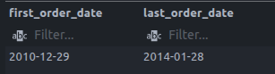
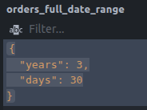

### Customer Age Range

Demographic data reveals a broad age distribution among the customer base. The youngest and oldest customer records clarify an age span of approximately **70 years, 4 months, and 15 days**.

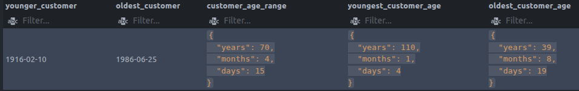

### Key Measurement Exploration

The following metrics provide a high-level view of our total scale, including total orders, store customers, product counts, total sales, and average pricing.

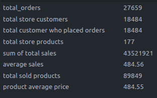

### Customers by Country

The **USA** represents our largest customer segment, followed by **Australia** and the **United Kingdom**.

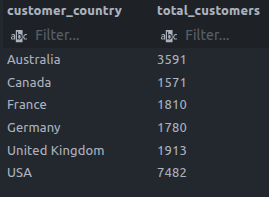

### Customers by Gender

The data indicates that Male customers outnumber Female customers. However, a significant "Unknown" category exists for customers who chose not to identify their gender, which could introduce minor bias in gender-based targeting.

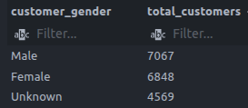

### Product Count by Category

The store maintains a higher volume of products in the **Components** section compared to others. The sub-category exploration below highlights the specific breakdown of these parts.

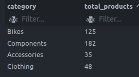
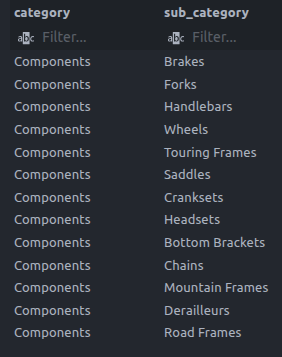

### Average Price per Category

Bikes and Components are the most expensive categories, averaging over **$300**, while Clothing and Accessories remain budget-friendly at under **$25**.

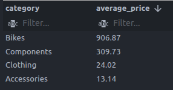

### Top 5 Products Sold

The top 5 most sold products are all variations of the **Mountain-200** bike, distinguished by different color options.

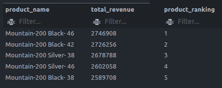

### Revenue vs. Volume by Country

While the **USA** leads in the total number of products sold, **Australia** generates higher total revenue. Deep-diving into the categories reveals that the USA has higher buying power for high-volume, lower-priced items, putting it in second place for total revenue despite the higher unit count.

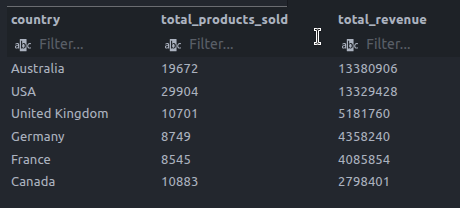
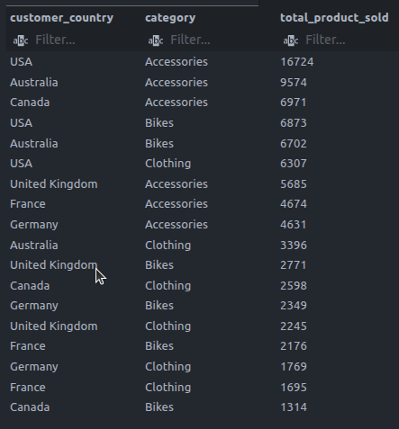

### Regional Product Preferences (USA vs. Australia)

The following analysis isolates the Top 5 products for our two largest markets. This comparison demonstrates that while both regions favor the Mountain-200 series, the specific model variations and quantities differ, reflecting unique regional consumer preferences and inventory demand.

### Top 3 Customers by Orders Placed

This ranking identifies our most frequent shoppers by their total order count and their position in the global customer list.

### Annual Sales Performance

Sales have increased gradually year-over-year, with revenue, customer counts, and quantities sold all showing growth from 2010 to 2013.

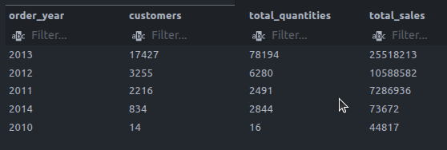

### Monthly Sales Seasonality (Running Total)

Analysis of monthly sales shows a steady climb throughout the year. **December** accounts for the highest sales volume, while **January** serves as the lowest point.

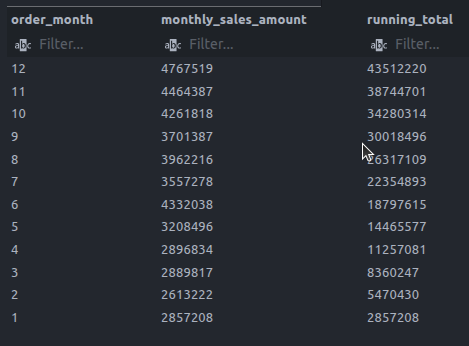

### Total Sales Percentage by Category

The **Bikes** category is the dominant force in our revenue model, accounting for **96%** of all sales across our stores.

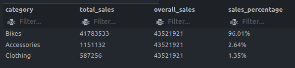

---

## 3. Data Segmentation

### Product Tiering (By Price)

Products are categorized into three cost tiers: **Budget** (Below $100), **Mid-Range** ($100 - $500), and **Premium** (Above $500).

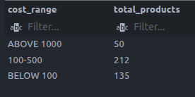

### Customer Segmentation (By Spend)

Customers are segmented into **New**, **Regular**, and **VIP** tiers based on their total lifetime spending.

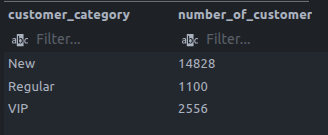

---

## 4. Conclusion

The analysis confirms a growing, bike-centric business. Strategic focus should remain on the high-value Australian market and peak-season preparation for December, while exploring growth in the lower-cost accessories categories.

_Report ending with data-driven visualizations to assist the management team in final decision-making._
